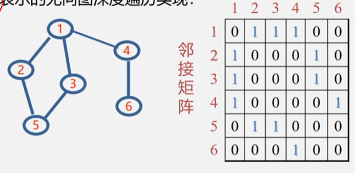

**图的遍历**

从已给的连通图中某一顶点出发，沿边访问图中所有顶点，每个顶点仅被访问一次。
遍历实质:找每个顶点的邻接点的过程。

如何避免重复访问?
解决思路:设置辅助数组visited[n],用来标记每个被访问过的顶点。
- 初始状态visited[i]为0。
- 顶点i被访问,改visited[i]为1，防止多次被访问。

**深度优先搜索DFS**

利用栈，一条路走到底全部入栈，没有路走则出栈重新找路，直到所有的顶点都被访问。



```
void DFS(AMGraph G, int V){
    //图G为邻接矩阵类型,V是开始的顶点
    visited[v] = true ;
    for(w=0;w<G.vexnum;w++){
        //依次检查邻接矩阵v所在行
        if((G.arcs[v][w]!=0)&&(!visited[w]))
            DFS(G,w);
            //w是v的邻接点，如果w未访问，则递归调用DFS
            //递归结束返回上一层,就是在实现回退的操作
    }
}
```
