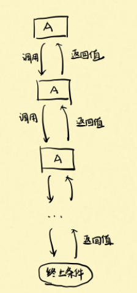

递归是一个很好理解的概念,但是每次自己写的时候老是写不出来,无意中发现了[这篇文章](https://lyl0724.github.io/2020/01/25/1/),这里记录下阅读笔记。

递归是一个反复调用自身的过程，说明它每一级的功能都是一样的，**只需要关注一级递归的解决过程**。



如图所示，只需要关注一级的A就行了。
需要将一个大规模问题划分成一个个小规模问题。

**需要知道的三个点**

1.整个递归的终止条件(基线条件):递归应该在什么时候结束？
2.找返回值:应该给上一级返回什么信息?
3.本级递归应该做什么:在这一级递归中，应该完成什么任务? 

## 104.求二叉树的最大深度

1.终止条件(基线条件)是什么?
    什么时候递归结束，树为空的时候，此时树的深度为0,返回0，递归就结束了。

2.应该返回什么？
    题目求的是树的最大深度，我们需要从每一级得到的信息应该是这一级对应的树的最大深度，返回值应该是的最大深度。

3.本级递归应该做什么？递归的目的是什么？
    首先，还是强调要走出之前的思维误区，递归后我们眼里的树一定是这个样子的，看下图。本级递归就三个节点：root、root.left、root.right，其中根据第二步，root.left和root.right分别记录的是root的左右子树的最大深度。那么本级递归应该做什么就很明确了，自然就是在root的左右子树中选择较大的一个，再加上1就是以root为根的子树的最大深度了，然后再返回这个深度即可。


**代码**

跟着这个作者的思路写了一下代码,快要感动哭了,第一次写递归写的如此的清晰容易。

```JAVA
class Solution {
    public int maxDepth(TreeNode root) {
        int max = 0;
        if(root == null){
            return 0;
        }
        int leftDepth = maxDepth(root.left);
        int rightDepth = maxDepth(root.right);
        max = Math.max(leftDepth,rightDepth) + 1;
        return max;
    }
}
```

## 24.两两交换链表中的结点

**思路**

1.终止条件(基线条件)是什么?
    什么时候递归结束，没有可以交换的结点就结束递归，也就是只剩下一个结点或者没有结点的时候。

2.应该返回什么？
    本题的目的是两两交换结点，那么本级递归应该向上一级返回交换好的链表，这里返回指向交换好链表的指针。

3.本级递归应该做什么？递归的目的是什么？
    因为返回值是交换好的链表，所以结合第二步，只考虑本级递归，这个链表在我们眼中其实就三个结点：head、head.next、已处理好的链表部分。
    因为前一级递归返回过来的是已经处理好的链表部分，也就是图中的第三个部分，在交换图中的前两个结点时，交换后需要连接上第三个部分，所以这里需要看见的是三个结点。


**代码**

```JAVA
class Solution {
    public ListNode swapPairs(ListNode head) {
        if(head == null || head.next == null){
            return head;
        }
      	//下面的任务便是交换这3个节点中的前两个节点
       ListNode next = head.next;
       head.next =  swapPairs(next.next);
       next.next = head;
       return next;
}
}
```

## 110.平衡二叉树

给定一个二叉树，判断它是否是高度平衡的二叉树。
本题中，一棵高度平衡二叉树定义为：
一个二叉树每个节点 的左右两个子树的高度差的绝对值不超过1

**思路**

1.终止条件(基线条件)是什么?
    树为空的时候

2.应该返回什么？
    它是一个平衡二叉树需要满足三个条件：它的左子树是平衡二叉树，它的右子树是平衡二叉树，它的左右子树的高度差不大于1。换句话说：如果它的左子树或右子树不是平衡二叉树，或者它的左右子树高度差大于1，那么它就不是平衡二叉树。
    这里我们返回的信息应该是既包含子树的深度的int类型的值，又包含子树是否是平衡二叉树的boolean类型的值。
    
    可以定义一个单独的ReturnNode类
    
    ```
    class ReturnNode{
    boolean isB;
    int depth;
    //构造方法
    public ReturnNode(int depth,boolean isB){
    this.isB = isB;
    this.depth = depth;
    }
    }
    ```

3.本级递归应该做什么？递归的目的是什么？
    目前树有三个节点：root，left，right。我们首先判断left子树和right子树是否是平衡二叉树，如果不是则直接返回false。再判断两树高度差是否不大于1，如果大于1也直接返回false。否则说明以root为节点的子树是平衡二叉树，那么就返回true和它的高度。


**代码**

```JAVA
/**
 * Definition for a binary tree node.
 * public class TreeNode {
 *     int val;
 *     TreeNode left;
 *     TreeNode right;
 *     TreeNode() {}
 *     TreeNode(int val) { this.val = val; }
 *     TreeNode(int val, TreeNode left, TreeNode right) {
 *         this.val = val;
 *         this.left = left;
 *         this.right = right;
 *     }
 * }
 */
class Solution {
    class ReturnNode{
        boolean isB;
        int depth;
        //构造方法
        public ReturnNode(int depth,boolean isB){
        this.isB = isB;
        this.depth = depth;
        }
    }
    //主函数
    public boolean isBalanced(TreeNode root) {
        return isBST(root).isB;
    }
    public ReturnNode isBST(TreeNode root){
        if(root == null){
            return new ReturnNode(0, true);
        }
        ReturnNode left = isBST(root.left);
        ReturnNode right = isBST(root.right);
        if(left.isB == false || right.isB == false){
            return new ReturnNode(0, false); 
        }
        if(Math.abs(left.depth - right.depth) > 1){
            return new ReturnNode(0, false);
        }
        return new ReturnNode(Math.max(left.depth,right.depth)+1,true);
    }
}
```