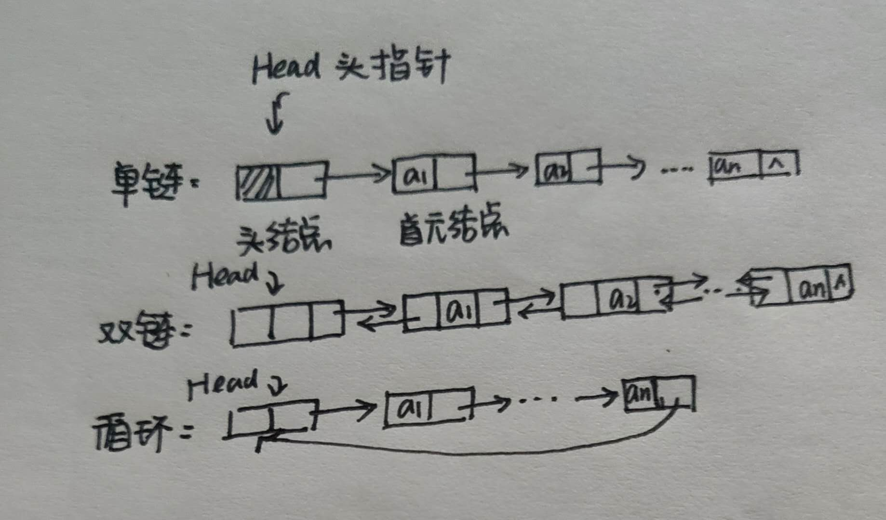
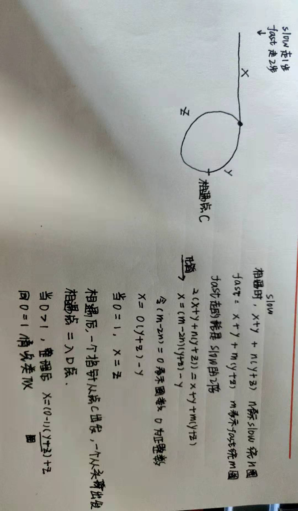

## 链表的结构



单链表:结点有一个指针域的链表
双链表:结点有两个指针域的链表，双向链表的本质就是空间换时间，因此如果题目对时间有要求，可以考虑使用双向链表，
循环链表:首尾相接的链表，当我们需要在遍历到尾部之后重新开始遍历的时候，可以考虑使用循环链表。

头指针:执行链表中第一个结点的指针。
首元结点:链表中存储第一个数据元素a1的结点。
头结点:链表首元结点之前的一个结点,往往不存储元素，作为附加结点。

**头结点**

1.如何表示空表?

无头结点,头指针为空时表示空表 head == null
有头结点,当头结点的指针域为空时表示空表 head.next == null

2.头结点的好处?

便于首元结点的处理
    首元节点的地址保存在头结点的指针域中，所以链表的第一个位置上的操作和其他位置一致，不需要进行特殊处理。
便于空表和非空表的统一处理
    
3.头结点的数据域内装什么？

可以为空，也可以存放线性表的长度等附加信息。但此结点在统计表长时不算入。

## 链表的基本操作

**判断链表是否为空**

```JAVA
boolean ListEmpty(ListNode head){
    return head.next == null
}
```

**单链表的销毁**

从头指针开始，依次释放所有的结点，包括了头结点。

```
while(L){
    //需要辅助结点p，p指向要销毁的结点
    P = L;
    L = L.next ;
    //Java中有垃圾回收机制,p = null
    delete p ;
}   
```

**清空链表**

链表仍存在，但链表中无元素，成为空链表，头指针和头结点仍然在。

```
//P从首元结点开始
p = L.next;
while(p){
    //q指向要清除的结点的下一个结点
    q = p.next;
    delete p ;
    p = q;
}

```

**结点的取值**

```
//p指针用于寻找，从首元结点开始，count表示计数,i表示要找的第几个元素

p = L.next;
count = 1;
while(p && count < i){
    P = p.next;
    count ++ ;
}
```

**结点的插入**

这里往往需要先遍历找到结点

```
temp = 待插入位置的前驱节点.next
待插入位置的前驱节点.next = 待插入指针
待插入指针.next = temp
```

### 结点的删除

只需要将需要删除的节点的前驱指针的 next 指针修正为其下下个节点即可，注意考虑边界条件。

伪代码：

```
待删除位置的前驱节点.next = 待删除位置的前驱节点.next.next
```

**遍历**

伪代码

```
当前指针 =  头指针
while 当前指针不为空 {
   print(当前节点)
   当前指针 = 当前指针.next
}
```


## 常见题型

链表的常见考点:
1.指针的修改
2.链表的拼接


### 反转链表

**迭代**

1.将某个链表进行反转
2.将某个链表按K个一组进行反转
3.在 O(n) 时间, O(1) 空间复杂度下逆序读取链表的某个值

反转的核心就是 当前的结点.next = pre 

伪代码

```
当前指针 = 头指针
前一个结点 = null
while 当前的指针不为空 {
    //因为需要修改当前结点的next,所以用一个新的next指针找到下一个结点
    下一个结点 = 当前指针.next;
    当前指针.next = 前一个节点
    前一个节点 = 当前指针
    当前指针 = 下一个节点
}
//最终pre指向第一个元素
return 前一个节点;
```

迭代的写法

```JS
let cur = head;
let pre = null;
while (cur) {
  const next = cur.next;
  cur.next = pre;
  pre = cur;
  cur = next;
}
return pre;
```

**递归**

以反转链表为例，结合之前做的两两交换链表中的结点,反转链表其实可以看成是每个结点都要改变。

可以想象前面的链表都处理好了。


套上递归三部曲:
1.终止条件(基线条件)是什么?
    反转链表的目的是每一个都反转，那么递归的结束条件是没有可以反转的就可以结束递归了，也就是为空

2.应该返回什么？
    根据图片，我们应该返回需要处理的下一个结点作为新的head；反转链表的话当然还是要返回一个处理好的链表。

3.本级递归应该做什么？递归的目的是什么？
    本级递归需要做的就是指向前面已经处理好的链表。

```Python
def dfs(head, pre):
    if not head: return pre
    next = head.next
    head.next = pre
    dfs(next, head)
dfs(head, None)
```

### 快慢指针

判断链表是否有环、链表的交点，以及环的入口都是使用快慢指针。

由于链表不支持随机访问，因为如果要获取链表中间项或倒数第几项等特定元素就需要快慢指针。
比如找链表中间项可以用两个指针，一个大步走(一次走两步)，一个小步走(一次走一步)，这样快指针走到头，慢指针刚好在中间。
比如找链表倒数第二个结点，可以让块指针先走一步，慢指针再走，这样快指针走到头，慢指针刚好在倒数第二个。

### 相交链表

找到两个单链表相交的起始节点。

[如图所示](https://assets.leetcode-cn.com/aliyun-lc-upload/uploads/2018/12/14/160_statement.png)

这种题目的重点就是

A单独的部分 + AB共有的部分 + B单独的部分 = B单独的部分 + AB共有的部分 + A单独的部分

这样一定在交点处相遇。即使没有交点，去掉AB共有的部分，等式也是成立的。


### 环形链表

#### 判断是否有环

**思路**
可以使用快慢指针法， 分别定义 fast 和 slow指针，从头结点出发，fast指针每次移动两个节点，slow指针每次移动一个节点，如果 fast 和 slow指针在途中相遇 ，说明这个链表有环。

- 问题：为什么一定在环中相遇？
在非环的位置，fast一定走的比slow快，所以fast一定会先进入环，然后在环中循环。slow是一步一步走的，那么在环中一定会相遇。

#### 求环的起点

**哈希法**

遍历整个链表，如果当前的结点不在哈希表中则添加之后继续遍历，如果在哈希表中,那么当前的结点就是环的入口结点。

时间复杂度：O(N)
空间复杂度：O(N) 新建一个哈希表

**快慢指针法**

